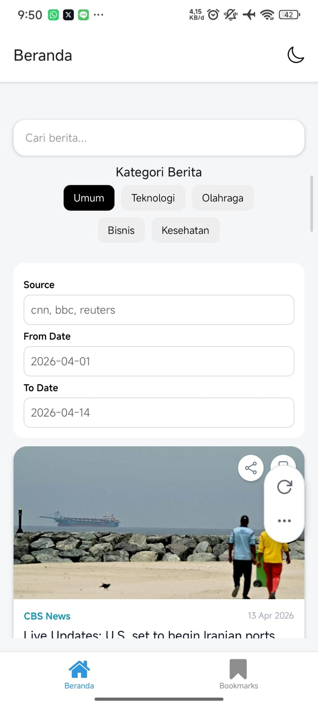

# News App - Mobile Lanjut (Expo)

## Informasi Mahasiswa

* Nama : Latanza Akbar Fadilah
* NIM  : 2410501004

## Deskripsi Aplikasi

**News App** adalah aplikasi mobile berbasis **React Native (Expo)** yang digunakan untuk membaca berita secara realtime dengan fitur pencarian, filter, bookmark offline, dan mode gelap. Aplikasi ini dirancang untuk memberikan pengalaman membaca berita yang cepat, ringan, dan personal.

Fitur utama aplikasi ini meliputi:

* News feed berdasarkan kategori
* Pencarian berita realtime dengan debounce
* Filter berita berdasarkan sumber dan rentang tanggal
* Bookmark offline menggunakan AsyncStorage
* Dark mode yang tersinkronisasi secara global
* Share artikel ke aplikasi lain

## Hooks yang Digunakan

Aplikasi ini menggunakan kombinasi hooks bawaan React dan custom hooks:

* **useState** : Digunakan untuk state lokal seperti kategori berita, input search, dan filter (source, date range).
* **useEffect** : Digunakan untuk sinkronisasi data async seperti load theme dari AsyncStorage dan debounce search query.
* **useMemo** : Digunakan untuk optimasi data artikel agar tidak re-render tidak perlu saat filter/search berubah.
* **useCallback** : Digunakan untuk optimasi fungsi seperti bookmark toggle dan navigation handler.
* **Custom Hooks** :

  * `useNews` → fetch berita dengan pagination (React Query)
  * `useNewsSearch` → pencarian berita dengan debounce
  * `useBookmarks` → manajemen bookmark offline (AsyncStorage)
  * `useDebounce` → optimasi input search
  * `useTheme` → dark/light mode global state

## Dependensi Utama

* **Expo & React Native** : Framework utama aplikasi
* **Expo Router** : Navigasi berbasis file system
* **React Query (@tanstack/react-query)** : Manajemen server state & caching API
* **AsyncStorage** : Penyimpanan lokal untuk bookmark & theme
* **React Navigation** : Manajemen theme (Dark/Light mode)
* **React Native Reanimated** : Animasi UI interaktif
* **Expo Sharing** : Share artikel ke aplikasi lain
* **Axios / Fetch API** : Request data berita

## Struktur Project

```
app/
 ├── (tabs)/
 │   ├── index.tsx (Home)
 │   ├── bookmarks.tsx
components/
 ├── NewsCard.tsx
 ├── FilterBar.tsx
 ├── CategoryFilter.tsx
 ├── ErrorView.tsx
context/
 ├── ThemeContext.tsx
 ├── SearchContext.tsx
hooks/
 ├── useNews.ts
 ├── useNewsSearch.ts
 ├── useBookmarks.ts
 ├── useDebounce.ts
services/
 ├── newsService.ts
```

## Screenshot

<div align="center">
  
  
</div>

## Cara Menjalankan

```bash
npm install
npx expo start
```

* Gunakan Expo Go untuk run di device
* Tekan `a` untuk Android emulator
* Tekan `i` untuk iOS simulator

## Poin Bonus Tambahan

### Dark Mode (Context API)

Dark mode diimplementasikan menggunakan `ThemeContext` yang menyimpan state global dan disimpan ke AsyncStorage agar persist.

### Bookmark Offline

Artikel dapat disimpan secara lokal dan tetap tersedia meskipun aplikasi offline.

### Search Optimization

Menggunakan debounce 500ms untuk mengurangi request API berlebihan.

### Infinite Scroll

Menggunakan React Query `useInfiniteQuery` untuk pagination berita.

### Share Feature

Artikel dapat dibagikan menggunakan `expo-sharing` ke aplikasi lain.

---

**Dibuat oleh:** Bone - Sistem Informasi
